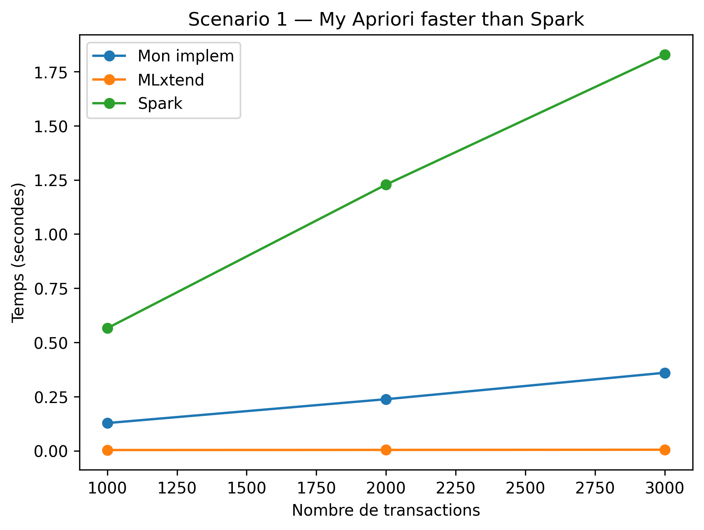
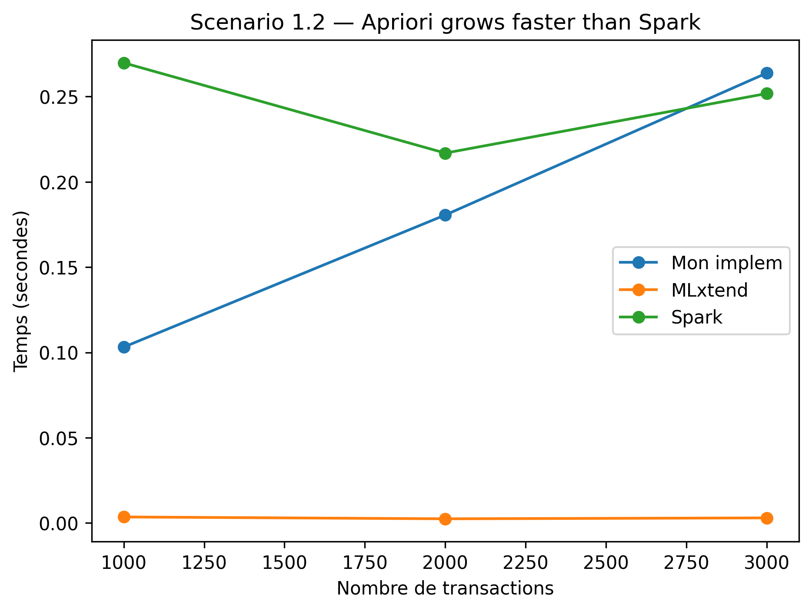
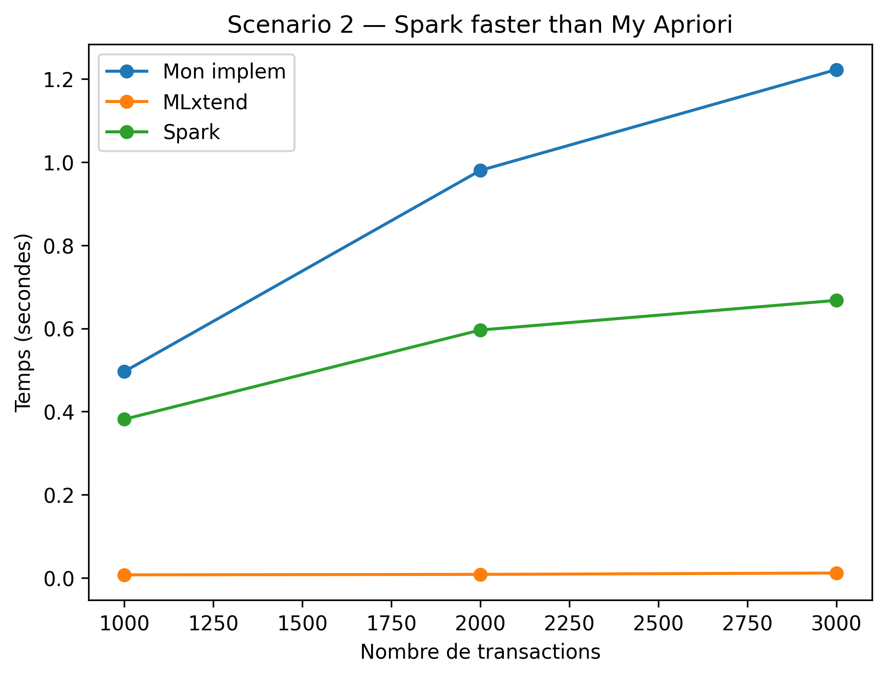

# Comparaison avec les implémentations de MLxtend et Spark MLlib

## Comparaison avec MLxtend
Dans cette section, nous comparons notre implémentation d’Apriori (Section 1 du TD) avec celle de la librairie MLxtend.

Notre code a été exécuté à partir du fichier `apriori_mlxtend.py` via :
```BASH
python3 apriori_mlxtend.py 
```
Le résultat obtenu avec MLxtend est :
```
   support          itemsets
0      0.6            (Beer)
1      0.8           (Bread)
2      0.8         (Diapers)
3      0.8            (Milk)
4      0.6   (Diapers, Beer)
5      0.6  (Bread, Diapers)
6      0.6     (Bread, Milk)
7      0.6   (Diapers, Milk)
```

Même si MLxtend utilise des structures internes optimisées (matrices binaires, opérations vectorisées), le principe algorithmique reste celui d’Apriori ; les itemsets fréquents obtenus doivent donc être identiques dès lors que le même seuil de support et la même structure de transactions sont utilisés.

La sortie détaillée de notre méthode Fk₋₁ × Fk₋₁ est :
``` 
1-itemsets
Beer 3 F
Bread 4 F
Coke 2 I
Diapers 4 F
Eggs 1 I
Milk 4 F
=========================
2-itemsets
Beer,Bread 2 I
Beer,Diapers 3 F
Beer,Milk 2 I
Bread,Diapers 3 F
Bread,Milk 3 F
Diapers,Milk 3 F
=========================
3-itemsets
Bread,Diapers,Milk 2 I
=========================
```
En ne conservant que les itemsets annotés F, nous obtenons :
- 1-itemsets fréquents : {Beer}, {Bread}, {Diapers}, {Milk}
- 2-itemsets fréquents : {Beer, Diapers}, {Bread, Diapers}, {Bread, Milk}, {Diapers, Milk}
- 3-itemsets fréquents : aucun

Pour faciliter la comparaison, nous avons ajouté une fonction d’affichage qui reproduit le format MLxtend :
```
support    itemsets
0.6        (Beer)
0.8        (Bread)
0.8        (Diapers)
0.8        (Milk)
0.6        (Beer, Diapers)
0.6        (Bread, Diapers)
0.6        (Bread, Milk)
0.6        (Diapers, Milk)
```

Cet ensemble correspond exactement aux itemsets fréquents retournés par MLxtend, tant au niveau des valeurs de support que de la composition des itemsets fréquents eux-mêmes.

---
## Comparaison avec Spark MLlib

Dans cette section, nous testons l’implémentation de Frequent Itemset Generation proposée par Spark MLlib, basée sur FP-Growth, une alternative plus efficace à Apriori pour des volumes de données importants.
Notre code Spark a été exécuté en mode local à partir du fichier `spark_fp.py` via :

```BASH
spark-submit spark_fp.py
```

Le résultat obtenu sur le même jeu de données `("Bread, Milk, Diapers, Beer, Coke")` est le suivant :
```
+----------------+----+
|items           |freq|
+----------------+----+
|[Bread]         |4   |
|[Diapers]       |4   |
|[Diapers, Bread]|3   |
|[Milk]          |4   |
|[Milk, Bread]   |3   |
|[Milk, Diapers] |3   |
|[Beer]          |3   |
|[Beer, Diapers] |3   |
+----------------+----+
```
Bien que Spark MLlib repose sur FP-Growth plutôt que sur Apriori, les itemsets fréquents générés doivent rester identiques lorsque :
- le jeu de transactions est le même,
- et que le même seuil de support (minsup = 0.6) est appliqué.

L’ensemble des itemsets fréquents obtenu avec Spark MLlib —
`{Bread}, {Diapers}, {Milk}, {Beer}, {Bread–Diapers}, {Bread–Milk}, {Diapers–Milk}, {Beer–Diapers}` —
correspond parfaitement aux résultats des deux sections précédentes (notre implémentation et MLxtend).

### Benchmark comparatif : notre implémentation, MLxtend et Spark MLlib
Pour cette dernière partie, nous avons comparé les performances de notre implémentation (méthode Fk₋₁ × Fk₋₁) avec celles de MLxtend et de Spark MLlib.

Le benchmark est réalisé pour 1000, 2000 et 3000 transactions, en mesurant le temps moyen d’exécution sur 3 répétitions.


**Interprétation des résultats**


<p align="center">
  
</p>

```PYTHON
n_items = 2000
min_width = 10
max_width = 300
```

<p align="center">
  
</p>

```PYTHON
n_items = 2000
min_width = 1
max_width = 10
```
<p align="center">
  
</p>

```PYTHON
n_items = 7000
min_width = 50
max_width = 60
```

MLxtend est le plus rapide dans tous les scénarios, avec des temps presque nuls. Son implémentation centralisée, basée sur des matrices binaires et des opérations vectorisées, le rend particulièrement efficace pour un usage sur une seule machine.

Notre implémentation Apriori reste plus lente que MLxtend mais stable et linéaire.
Les résultats varient selon la densité des transactions :

- Scénario 1 (2000 items, largeur 10–300) :
    - Transactions peu denses alors très peu d’items par transaction.
    - Apriori : peu de candidats 
    - FP-Growth : FP-tree peu compressé ( parce que FP-tree efficace uniquement si co-occurrences élevées).
    Donc, Apriori plus rapide, Spark pénalisé par un FP-tree peu utile.

- Scénario 1.2 (2000 items, largeur 1–10) :
    - Transactions très clairsemées alors co-occurrence très faible.
    - Apriori : quasi pas de candidats, exécution immédiate.
    - FP-Growth : FP-tree très petit, donc coût réduit mais pas de compression significative.
    Donc, Spark se rapproche, mais Apriori reste devant car FP-tree n’apporte toujours pas d’avantage.

- Scénario 2 (7000 items, largeur 50–60) :
    - Transactions denses alors beaucoup d’items apparaissent ensemble.

    - Apriori : explosion de candidats (theoretical weakness du modèle Apriori).

    - FP-Growth : FP-tree fortement compressé (theoretical strength : compression et pas de génération de candidats).
    Et le nombre de items est élevé.
    Donc, Spark devient plus rapide grâce à FP-Growth adapté aux données denses.

**Discussion**:

L’implémentation à choisir dépend fortement du contexte et de la taille des données :

Notre implémentation Apriori
Convient pour les jeux de données petits ou clairsemés et lorsqu’on souhaite étudier, comprendre ou modifier le fonctionnement interne de l’algorithme.

MLxtend (centralisée)
Idéal pour un usage local, sur une seule machine, lorsque les données sont petites à moyennes et qu’on recherche la meilleure performance sans surcharge. C’est la solution la plus efficace dans la plupart des cas pratiques non distribués.

Spark MLlib (distribuée)
Pertinent seulement quand les données deviennent très volumineuses ou denses, ou lorsqu’on dispose d’un cluster. FP-Growth exploite alors mieux la structure du dataset et offre un passage à l’échelle que les implémentations centralisées ne peuvent pas atteindre.