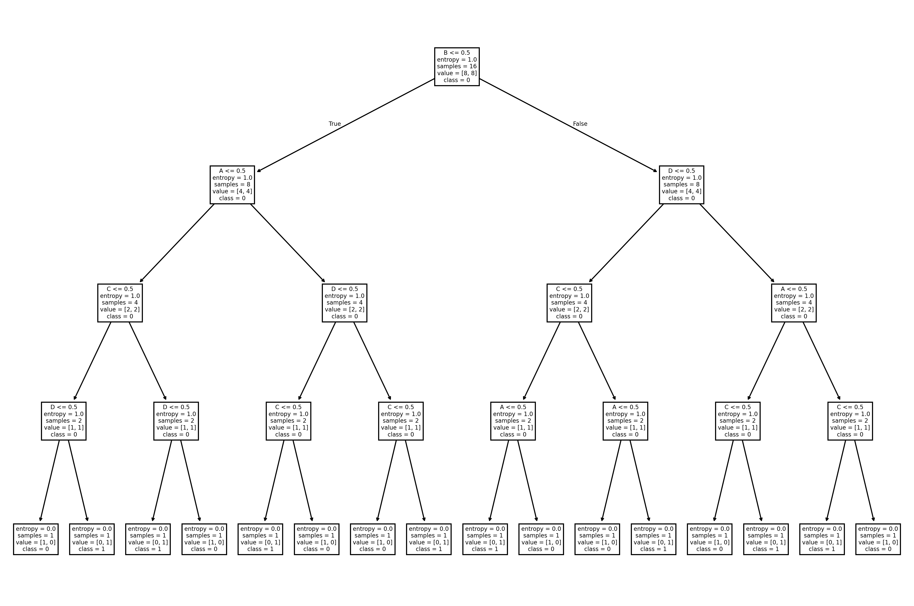

# TD3 - Arbres de Décision
## Data Mining - Contrôle Continu

---

## Instructions pour exécuter le code

Pour exécuter les exercices de ce TD :

```bash
# Pour l'exercice 1
cd TD3/src/exo1
python run_exo1.py

# Pour l'exercice 2
cd TD3/src/exo2
python run_exo2.py

# Pour l'exercice 3
cd TD3/src/exo3
python run_exo3.py

# Pour l'exercice 4
cd TD3/src/exo4
python run_exo4.py

# Pour l'exercice 5
cd TD3/src/exo5
python run_exo5.py

# Pour l'exercice 6
cd TD3/src/exo6
python run_exo6.py
```

**Note :** L'exercice 6 génère automatiquement une visualisation de l'arbre de décision dans `src/images/exo6/parity_tree_entropy.png`.

---

## Exercice 1 : Mesures d'impureté

### 1(a) Implémentation des fonctions

Nous avons implémenté trois fonctions de mesure d'impureté dans [impurity_measures.py](src/exo1/impurity_measures.py) :

1. **Entropy** : Utilise la formule $H = -\sum_{j} p_j \log_2(p_j)$
2. **Gini** : Utilise la formule $Gini = 1 - \sum_{j} p_j^2$
3. **Classification Error** : Utilise la formule $Error = 1 - \max_j(p_j)$

Ces fonctions prennent en entrée une liste de probabilités dont la somme est égale à 1.

### 1(b) Tests avec les exemples du livre

Nous avons testé les trois mesures d'impureté avec les exemples de la page 159 :

| Probabilités | Entropy | Gini | Misclassification Error |
|--------------|---------|------|-------------------------|
| [0.0, 1.0] | 0.0000 | 0.0000 | 0.0000 |
| [0.1667, 0.8333] | 0.6500 | 0.2778 | 0.1667 |
| [0.5, 0.5] | 1.0000 | 0.5000 | 0.5000 |

**Résultats obtenus :**
```
probs = [0.0, 1.0]
  Entropy            = 0.0000
  Gini               = 0.0000
  Misclass. error    = 0.0000

probs = [0.1667, 0.8333]
  Entropy            = 0.6500
  Gini               = 0.2778
  Misclass. error    = 0.1667

probs = [0.5, 0.5]
  Entropy            = 1.0000
  Gini               = 0.5000
  Misclass. error    = 0.5000
```

Ces résultats correspondent exactement à ceux attendus dans le livre (page 159).

### 1(c) Reproduction de la Figure 4.13

Nous avons reproduit la figure comparant les trois mesures d'impureté pour les problèmes de classification binaire.

**[PLACEHOLDER : Insérer l'image générée par le script run_exo1.py]**
*Image à importer : Capture d'écran du graphique matplotlib montrant les trois courbes (Entropy, Gini, Misclassification error) en fonction de p*

La figure montre que :
- L'**entropie** et le **Gini** atteignent leur maximum à p = 0.5 (impureté maximale)
- L'**erreur de classification** a une forme triangulaire
- Les trois mesures valent 0 aux extrémités (p = 0 ou p = 1), indiquant une pureté totale

---

## Exercice 2 : Calcul de l'impureté après split

### 2(a) Fonction impurity_split

Nous avons implémenté la fonction `impurity_split(cnt, impurity_function)` dans [impurity_split.py](src/exo2/impurity_split.py:3) qui calcule l'impureté pondérée d'un split.

**Tests effectués :**

```python
d1 = {"N1": {"C0": 4, "C1": 3}, "N2": {"C0": 2, "C1": 3}}
d2 = {"N1": {"C0": 1, "C1": 4}, "N2": {"C0": 5, "C1": 2}}
```

**Résultats :**
- `d1` avec Gini : **0.486** (attendu ≈ 0.486) 
- `d2` avec Gini : **0.371** (attendu ≈ 0.371) 

Ces résultats correspondent aux calculs détaillés page 161 du livre.

### Dataset utilisé pour les questions suivantes

Nous utilisons le dataset fourni avec 20 clients et 5 attributs : Customer ID, Gender, Car Type, Shirt Size, et Class (C0 ou C1).

### 2(b) Indice de Gini du dataset

**Gini(dataset) = 0.500**

Calcul : Le dataset contient 10 instances de C0 et 10 instances de C1.
$$Gini = 1 - (0.5^2 + 0.5^2) = 1 - 0.5 = 0.5$$

### 2(c) Indice de Gini de l'attribut Customer ID

**Gini(Customer ID) = 0.000**

Explication : Chaque Customer ID est unique et correspond à exactement une instance. Le split crée donc 20 nœuds purs (chacun avec une seule classe), donnant un Gini de 0.

### 2(d) Indice de Gini de l'attribut Gender

**Gini(Gender) ≈ 0.480**

Détails du split :
- **M (Male)** : 6 instances de C0, 4 instances de C1
- **F (Female)** : 4 instances de C0, 6 instances de C1

Calcul du Gini pondéré :
- Gini(M) = 1 - (0.6² + 0.4²) = 0.48
- Gini(F) = 1 - (0.4² + 0.6²) = 0.48
- Gini_split = (10/20) × 0.48 + (10/20) × 0.48 = 0.48

### 2(e) Indice de Gini de l'attribut Car Type

#### Multiway split
**Gini(Car Type) ≈ 0.163**

Distribution :
- **Family** : 1 instance C0, 3 instances C1
- **Sports** : 7 instances C0, 0 instances C1
- **Luxury** : 2 instances C0, 7 instances C1

#### Binary splits

Nous avons testé toutes les combinaisons possibles de binary splits :

| Split | Gini |
|-------|------|
| {Family} vs {Sports, Luxury} | 0.450 |
| {Sports} vs {Family, Luxury} | 0.300 |
| {Luxury} vs {Family, Sports} | 0.405 |

Le meilleur binary split est **{Sports} vs {Family, Luxury}** avec Gini = 0.300.

### 2(f) Indice de Gini de l'attribut Shirt Size (multiway split)

**Gini(Shirt Size) ≈ 0.491**

Distribution :
- **Small** : 3 instances C0, 2 instances C1
- **Medium** : 3 instances C0, 4 instances C1
- **Large** : 2 instances C0, 2 instances C1
- **Extra Large** : 2 instances C0, 2 instances C1

L'attribut Shirt Size ne permet pas une bonne séparation des classes (Gini proche de 0.5).

### 2(g) Meilleur attribut parmi Gender, Car Type et Shirt Size

**Comparaison des indices de Gini :**

| Attribut | Gini (multiway) |
|----------|-----------------|
| Gender | 0.480 |
| Car Type | **0.163** |
| Shirt Size | 0.491 |

**Conclusion :** **Car Type** est le meilleur attribut car il a le plus faible indice de Gini (0.163). Cela signifie qu'il permet la meilleure séparation des classes et réduit le plus l'impureté.

### 2(h) Pourquoi ne pas utiliser Customer ID ?

Bien que Customer ID ait un indice de Gini de 0.0 (le plus faible possible), **il ne doit pas être utilisé comme attribut de test** pour les raisons suivantes :

1. **Identifiant unique** : Chaque Customer ID correspond à une seule instance du dataset
2. **Overfitting** : Le modèle mémoriserait simplement chaque exemple d'entraînement
3. **Absence de généralisation** : L'arbre ne pourrait pas classifier de nouveaux clients avec des IDs différents
4. **Pas de valeur prédictive** : L'ID n'a aucune relation causale ou sémantique avec la classe cible

En résumé, utiliser Customer ID reviendrait à créer une table de correspondance plutôt qu'un véritable modèle de classification généralisant.

---

## Exercice 3 : Gain d'information et attributs continus

### Dataset utilisé

Nous utilisons un dataset avec 9 instances, 3 attributs (a1, a2 catégoriques et a3 continu) et 2 classes cibles (+ et -).

### 3(a) Entropie du dataset

**H(D) = 0.991**

Distribution des classes :
- Classe `-` : 5 instances
- Classe `+` : 4 instances

Calcul :
$$H(D) = -\frac{5}{9}\log_2(\frac{5}{9}) - \frac{4}{9}\log_2(\frac{4}{9}) \approx 0.991$$

L'entropie est proche de 1, ce qui indique une distribution relativement équilibrée des classes.

### 3(b) Gain d'information pour a1 et a2

#### Attribut a1

**Résultats :**
- H(D) = 0.991
- **Gain(a1) = 0.229**

Détails du split :
- **a1 = T** : 3 instances `+`, 1 instance `-` → H = 0.811
- **a1 = F** : 1 instance `+`, 4 instances `-` → H = 0.722

Entropie pondérée après split :
$$H(D|a1) = \frac{4}{9} \times 0.811 + \frac{5}{9} \times 0.722 = 0.762$$

Gain d'information :
$$Gain(a1) = 0.991 - 0.762 = 0.229$$

#### Attribut a2

**Résultats :**
- H(D) = 0.991
- **Gain(a2) = 0.007**

Détails du split :
- **a2 = T** : 2 instances `+`, 3 instances `-` → H = 0.971
- **a2 = F** : 2 instances `+`, 2 instances `-` → H = 1.000

Entropie pondérée après split :
$$H(D|a2) = \frac{5}{9} \times 0.971 + \frac{4}{9} \times 1.000 = 0.984$$

Gain d'information :
$$Gain(a2) = 0.991 - 0.984 = 0.007$$

L'attribut a1 apporte beaucoup plus d'information (0.229) que a2 (0.007).

### 3(c) Gain d'information pour l'attribut continu a3

Pour un attribut continu, nous testons tous les seuils possibles entre valeurs consécutives.

**Valeurs de a3 :** [1.0, 3.0, 4.0, 5.0, 5.0, 6.0, 7.0, 7.0, 8.0]

**Seuils testés et résultats :**

| Seuil | Split | Left | Right | H_split | Gain |
|-------|-------|------|-------|---------|------|
| a3 ≤ 2.0 | {1.0} vs {3.0, 4.0, ...} | Counter({'+': 1}) | Counter({'-': 5, '+': 3}) | 0.848 | **0.143** |
| a3 ≤ 3.5 | {1.0, 3.0} vs {4.0, ...} | Counter({'+': 1, '-': 1}) | Counter({'-': 4, '+': 3}) | 0.989 | 0.003 |
| a3 ≤ 4.5 | {1.0, 3.0, 4.0} vs {...} | Counter({'+': 2, '-': 1}) | Counter({'-': 4, '+': 2}) | 0.918 | 0.073 |
| a3 ≤ 5.5 | {1.0, ..., 5.0} vs {...} | Counter({'-': 3, '+': 2}) | Counter({'+': 2, '-': 2}) | 0.984 | 0.007 |
| a3 ≤ 6.5 | {1.0, ..., 6.0} vs {...} | Counter({'+': 3, '-': 3}) | Counter({'-': 2, '+': 1}) | 0.973 | 0.018 |
| a3 ≤ 7.5 | {1.0, ..., 7.0} vs {8.0} | Counter({'+': 4, '-': 4}) | Counter({'-': 1}) | 0.889 | 0.102 |

**Meilleur seuil pour a3 :** a3 ≤ 2.0 avec **Gain = 0.143**

### 3(d) Meilleur split selon le gain d'information

**Comparaison des gains d'information :**

| Attribut | Gain |
|----------|------|
| a1 | **0.229** |
| a2 | 0.007 |
| a3 (seuil ≤ 2.0) | 0.143 |

**Conclusion :** L'attribut **a1** offre le meilleur split avec un gain d'information de 0.229, suivi de a3 (0.143) puis a2 (0.007).

Le gain d'information mesure la réduction d'entropie apportée par le split. Plus le gain est élevé, plus l'attribut est informatif pour la classification.

### 3(e) Meilleur split entre a1 et a2 selon l'erreur de classification

**Résultats :**

| Attribut | Taux d'erreur pondéré |
|----------|-----------------------|
| a1 | **0.222** |
| a2 | 0.444 |

**Conclusion :** L'attribut **a1** est meilleur (erreur plus faible : 0.222 vs 0.444).

Détails pour a1 :
- a1 = T : 4 instances, classe majoritaire `+` (3), erreur locale = 1/4 = 0.25
- a1 = F : 5 instances, classe majoritaire `-` (4), erreur locale = 1/5 = 0.20
- Erreur pondérée = (4/9) × 0.25 + (5/9) × 0.20 = 0.222

Détails pour a2 :
- a2 = T : 5 instances, classe majoritaire `-` (3), erreur locale = 2/5 = 0.40
- a2 = F : 4 instances, classes équilibrées (2, 2), erreur locale = 2/4 = 0.50
- Erreur pondérée = (5/9) × 0.40 + (4/9) × 0.50 = 0.444

### 3(f) Meilleur split entre a1 et a2 selon l'indice de Gini

**Résultats :**

| Attribut | Gini split |
|----------|------------|
| a1 | **0.344** |
| a2 | 0.489 |

**Conclusion :** L'attribut **a1** est meilleur (Gini plus faible : 0.344 vs 0.489).

Détails pour a1 :
- a1 = T : Gini = 1 - ((3/4)² + (1/4)²) = 0.375
- a1 = F : Gini = 1 - ((1/5)² + (4/5)²) = 0.320
- Gini pondéré = (4/9) × 0.375 + (5/9) × 0.320 = 0.344

Détails pour a2 :
- a2 = T : Gini = 1 - ((2/5)² + (3/5)²) = 0.480
- a2 = F : Gini = 1 - ((2/4)² + (2/4)²) = 0.500
- Gini pondéré = (5/9) × 0.480 + (4/9) × 0.500 = 0.489

### Synthèse de l'exercice 3

Toutes les mesures d'impureté (gain d'information, erreur de classification, indice de Gini) convergent vers la même conclusion : **l'attribut a1 est le meilleur choix pour le premier split** de l'arbre de décision.

Comparaison des trois mesures pour a1 vs a2 :
- Gain d'information : a1 (0.229) >> a2 (0.007)
- Erreur de classification : a1 (0.222) < a2 (0.444)
- Indice de Gini : a1 (0.344) < a2 (0.489)

L'attribut a1 réduit significativement l'impureté, tandis que a2 n'apporte presque aucune information discriminante. Pour l'attribut continu a3, le meilleur seuil (≤ 2.0) offre un gain modéré mais reste inférieur à a1.

---

## Exercice 4 : Comparaison des critères de sélection

### Dataset utilisé

Un dataset avec 10 instances, 2 attributs binaires (A et B) et 2 classes (+ et -).

Distribution des données :
- 4 instances de classe `+`
- 6 instances de classe `-`

**[PLACEHOLDER : Insérer l'image des résultats d'exécution]**
*Image à importer : Capture d'écran de la sortie du programme run_exo4.py montrant les calculs détaillés*

### 4(a) Gain d'information pour A et B

**Entropie du dataset :** H(D) = 0.971

#### Attribut A

**Résultats :**
- H(D) = 0.971
- **Gain(A) = 0.281**

Détails du split :
- **A = T** : n=7, distribution {'+': 4, '-': 3} → H = 0.985
- **A = F** : n=3, distribution {'-': 3} → H = 0.000

Entropie pondérée après split :
$$H(D|A) = \frac{7}{10} \times 0.985 + \frac{3}{10} \times 0.000 = 0.690$$

Gain d'information :
$$Gain(A) = 0.971 - 0.690 = 0.281$$

L'attribut A crée un nœud parfaitement pur (A = F contient uniquement des instances de classe `-`).

#### Attribut B

**Résultats :**
- H(D) = 0.971
- **Gain(B) = 0.256**

Détails du split :
- **B = F** : n=5, distribution {'-': 5, '+': 1} → H = 0.650
- **B = T** : n=4, distribution {'+': 3, '-': 1} → H = 0.811

Entropie pondérée après split :
$$H(D|B) = \frac{5}{10} \times 0.650 + \frac{4}{10} \times 0.811 = 0.715$$

Gain d'information :
$$Gain(B) = 0.971 - 0.715 = 0.256$$

**Conclusion selon le gain d'information :** L'attribut **A** est meilleur (0.281 > 0.256).

### 4(b) Gain de Gini pour A et B

**Indice de Gini du dataset :** Gini(D) = 0.480

Calcul :
$$Gini(D) = 1 - \left(\frac{4}{10}\right)^2 - \left(\frac{6}{10}\right)^2 = 1 - 0.16 - 0.36 = 0.480$$

#### Attribut A

**Résultats :**
- Gini(D) = 0.480
- **Gini gain(A) = 0.137**

Détails du split :
- **A = T** : n=7, distribution {'+': 4, '-': 3} → Gini = 0.490
- **A = F** : n=3, distribution {'-': 3} → Gini = 0.000

Gini pondéré après split :
$$Gini(D|A) = \frac{7}{10} \times 0.490 + \frac{3}{10} \times 0.000 = 0.343$$

Gain de Gini :
$$Gini\_gain(A) = 0.480 - 0.343 = 0.137$$

#### Attribut B

**Résultats :**
- Gini(D) = 0.480
- **Gini gain(B) = 0.163**

Détails du split :
- **B = F** : n=5, distribution {'-': 5, '+': 1} → Gini = 0.278
- **B = T** : n=4, distribution {'+': 3, '-': 1} → Gini = 0.375

Gini pondéré après split :
$$Gini(D|B) = \frac{5}{10} \times 0.278 + \frac{4}{10} \times 0.375 = 0.317$$

Gain de Gini :
$$Gini\_gain(B) = 0.480 - 0.317 = 0.163$$

**Conclusion selon le gain de Gini :** L'attribut **B** est meilleur (0.163 > 0.137).

### 4(c) Comparaison : les deux critères peuvent-ils favoriser des attributs différents ?

**Réponse : OUI**

Cet exercice démontre empiriquement que le gain d'information et le gain de Gini peuvent favoriser des attributs différents :

| Critère | Meilleur attribut | Score |
|---------|-------------------|-------|
| Gain d'information (Entropy) | **A** | 0.281 |
| Gain de Gini | **B** | 0.163 |

**Analyse :**

- **Gain d'information** : Favorise l'attribut A car il crée un sous-ensemble parfaitement pur (A = F avec 100% de classe `-`). L'entropie récompense fortement la création de nœuds purs.

- **Gain de Gini** : Favorise l'attribut B car il crée deux sous-ensembles relativement équilibrés avec une meilleure séparation globale. Le Gini favorise une répartition plus équilibrée des instances.

**Pourquoi cette différence ?**

Les deux mesures d'impureté ont des sensibilités différentes :
- L'**entropie** est plus sensible aux petits changements de probabilité et récompense davantage les splits qui créent des nœuds très purs, même si ces nœuds sont de petite taille.
- Le **Gini** est une mesure plus "équilibrée" qui favorise les splits créant des partitions plus uniformes en taille avec une bonne séparation.

Cette différence illustre qu'il n'existe pas de "meilleure" mesure d'impureté universelle - le choix dépend du problème et des caractéristiques souhaitées pour l'arbre de décision.

---

## Exercice 5 : Principe MDL (Minimum Description Length)

### Contexte

Cet exercice utilise le principe du **rasoir d'Occam** via la **Longueur de Description Minimale (MDL)** pour comparer deux arbres de décision générés à partir d'un dataset avec :
- **16 attributs binaires**
- **3 classes** (C1, C2, C3)

Le principe MDL favorise le modèle qui minimise le coût total d'encodage : **Cost(tree) + Cost(data|tree)**

**Structure des arbres :**

**Arbre gauche (left tree) :**
```
     Root
    /    \
   C1    Internal
         /       \
        C2       C3
```
- 2 nœuds internes
- 3 feuilles
- 7 erreurs de classification

**Arbre droit (right tree) :**
```
        Root
       /    \
  Internal   C3
   /    \
  C1    C2
```
- 3 nœuds internes
- 4 feuilles
- 4 erreurs de classification

**[PLACEHOLDER : Insérer l'image des résultats d'exécution]**
*Image à importer : Capture d'écran de la sortie du programme run_exo5.py montrant les calculs de coûts*

### 5(a) Calcul de Cost(tree)

Le coût d'encodage d'un arbre comprend :
- **Nœuds internes** : chaque nœud encode l'ID de l'attribut de split → $\lceil \log_2(m) \rceil$ bits
- **Feuilles** : chaque feuille encode l'ID de la classe → $\lceil \log_2(k) \rceil$ bits

Avec m = 16 attributs et k = 3 classes :
- $\lceil \log_2(16) \rceil = 4$ bits par nœud interne
- $\lceil \log_2(3) \rceil = 2$ bits par feuille

**Arbre gauche :**
```
Cost(tree_left) = 2 × 4 + 3 × 2 = 8 + 6 = 14 bits
```

**Arbre droit :**
```
Cost(tree_right) = 3 × 4 + 4 × 2 = 12 + 8 = 20 bits
```

L'arbre gauche a un coût d'encodage plus faible (14 < 20) car il est plus simple (moins de nœuds).

### 5(b) Quel arbre est le meilleur selon MDL ?

Le coût total selon MDL est :
```
Total Cost = Cost(tree) + Cost(data|tree)
```

Où **Cost(data|tree)** encode les erreurs de classification :
```
Cost(data|tree) = nb_errors × ⌈log₂(n)⌉
```

**Résultats pour différentes valeurs de n :**

| n (taille dataset) | Arbre gauche (7 erreurs) | Arbre droit (4 erreurs) | Meilleur arbre |
|-------------------|--------------------------|-------------------------|----------------|
| n = 8 | 14 + 7×3 = **35 bits** | 20 + 4×3 = **32 bits** | **Droit** ✓ |
| n = 16 | 14 + 7×4 = **42 bits** | 20 + 4×4 = **36 bits** | **Droit** ✓ |
| n = 32 | 14 + 7×5 = **49 bits** | 20 + 4×5 = **40 bits** | **Droit** ✓ |
| n = 64 | 14 + 7×6 = **56 bits** | 20 + 4×6 = **44 bits** | **Droit** ✓ |

**Analyse détaillée :**

Pour n = 16 (exemple) :
- Arbre gauche : Cost(tree) = 14, Cost(data|tree) = 7 × ⌈log₂(16)⌉ = 7 × 4 = 28 → **Total = 42 bits**
- Arbre droit : Cost(tree) = 20, Cost(data|tree) = 4 × ⌈log₂(16)⌉ = 4 × 4 = 16 → **Total = 36 bits**

**Conclusion générale :**

L'**arbre droit est toujours meilleur** selon le principe MDL, pour toutes les valeurs de n testées.

**Pourquoi ?**

Bien que l'arbre droit soit plus complexe (Cost(tree) = 20 vs 14), il commet **moins d'erreurs** (4 vs 7). Le gain sur le coût des erreurs (Cost(data|tree)) compense largement le surcoût de la structure de l'arbre.

**Formule de l'écart :**
```
Différence = (14 + 7×⌈log₂(n)⌉) - (20 + 4×⌈log₂(n)⌉)
           = -6 + 3×⌈log₂(n)⌉
```

Pour n ≥ 8 : ⌈log₂(n)⌉ ≥ 3, donc 3×⌈log₂(n)⌉ ≥ 9 > 6

L'arbre droit devient et reste meilleur dès que n ≥ 8.

**Discussion sur n :**

La question demande de discuter en fonction des valeurs possibles de n. Analysons les cas limites :

- **Pour n très petit** (n < 8) : Si n = 4, ⌈log₂(4)⌉ = 2
  - Gauche : 14 + 7×2 = 28 bits
  - Droit : 20 + 4×2 = 28 bits
  - Les deux arbres sont équivalents !

- **Pour n = 2** : ⌈log₂(2)⌉ = 1
  - Gauche : 14 + 7×1 = 21 bits
  - Droit : 20 + 4×1 = 24 bits
  - L'arbre gauche devient meilleur !

**Point de bascule :** n = 4 est le point d'équilibre. Pour n < 4, l'arbre gauche (plus simple) est préférable. Pour n ≥ 4, l'arbre droit (plus précis) devient meilleur.

### Interprétation du principe MDL

Le principe MDL illustre un **compromis fondamental** en apprentissage automatique :

1. **Simplicité du modèle** (Cost(tree)) : favorise les arbres petits et simples
2. **Précision du modèle** (Cost(data|tree)) : favorise les arbres qui commettent peu d'erreurs

MDL pénalise à la fois :
- Les modèles trop complexes (overfitting potentiel)
- Les modèles trop imprécis (underfitting)

Dans cet exemple, l'arbre droit, bien que plus complexe, est justifié par sa meilleure précision lorsque le dataset est suffisamment grand (n ≥ 4).

---

## Exercice 6 : Utilisation de sklearn et fonction de parité

### Contexte

Cet exercice utilise **scikit-learn** pour construire des arbres de décision sur la **fonction de parité**, un problème classique qui teste les limites des algorithmes d'apprentissage.

**Fonction de parité :** La classe vaut 1 si et seulement si le nombre d'attributs valant 1 est impair.

### 6(a) Génération du dataset de parité

Nous avons généré un dataset avec 5 attributs (A, B, C, D, Class) encodant la fonction de parité de 4 attributs booléens.

**Caractéristiques du dataset :**
- **16 tuples** : toutes les combinaisons possibles de 4 attributs binaires (2⁴ = 16)
- **Attributs** : A, B, C, D ∈ {0, 1}
- **Classe** : Class = 1 si (A + B + C + D) est impair, 0 sinon

**Exemples de tuples :**

| A | B | C | D | Class |
|---|---|---|---|-------|
| 0 | 0 | 0 | 0 | 0 |
| 0 | 0 | 0 | 1 | 1 |
| 0 | 0 | 1 | 0 | 1 |
| 0 | 0 | 1 | 1 | 0 |
| 0 | 1 | 0 | 0 | 1 |

Le dataset complet contient exactement 16 instances (8 de classe 0, 8 de classe 1).

### 6(b) Encodage pour sklearn et limitation des types

Pour utiliser `DecisionTreeClassifier.fit()`, nous devons encoder les données en format numérique :

```python
X = np.array([[a, b, c, d], ...], dtype=float)  # shape: (16, 4)
y = np.array([class_label, ...], dtype=int)      # shape: (16,)
```

**Limitation observée concernant le type de données :**

Scikit-learn **n'accepte que des données numériques** (int, float) pour les features. Les types de données suivants **ne sont pas acceptés directement** :
- Chaînes de caractères ('T', 'F', 'True', 'False')
- Valeurs booléennes Python (True, False) *[doivent être converties en 0/1]*
- Variables catégorielles textuelles

**Conséquence pratique :** Avant d'utiliser sklearn, il faut toujours **encoder les variables catégorielles et booléennes en nombres**. Pour des catégories non ordonnées, on utilise généralement le **One-Hot Encoding**.

Dans notre cas, les booléens sont naturellement encodés comme 0 et 1, donc la conversion est directe.

### 6(c) Arbres de décision avec différents paramètres

Nous avons généré plusieurs arbres en variant les paramètres pour observer les changements.



**Résultats des différentes configurations :**

| Configuration | Critère | random_state | max_depth | Accuracy |
|---------------|---------|--------------|-----------|----------|
| 1 | entropy | 0 | None | **1.0** |
| 2 | gini | 0 | None | **1.0** |
| 3 | entropy | 42 | None | **1.0** |
| 4 | entropy | 0 | 2 | **0.5** (underfitting) |

**Observations :**

#### 1. Changement de mesure d'impureté (entropy vs gini)

**Sans changement apparent !** Les deux critères produisent des arbres parfaitement précis (accuracy = 1.0).

**Explication :** Pour la fonction de parité, l'arbre optimal doit être un arbre binaire complet de profondeur 4 (utilisant tous les attributs). Peu importe le critère d'impureté, l'algorithme finit par construire cet arbre complet pour classifier correctement toutes les instances.

#### 2. Changement de random_state

**Sans changement significatif !** L'accuracy reste à 1.0.

**Explication :** Le paramètre `random_state` contrôle l'aléatoire lors des choix (par exemple, quand deux attributs ont le même gain). Pour la fonction de parité, même si l'ordre des splits peut légèrement changer, l'arbre final doit utiliser tous les 4 attributs pour atteindre une précision parfaite.

**Différences possibles :**
- L'ordre des attributs testés peut varier
- La structure exacte de l'arbre peut différer
- Mais la précision finale et le nombre de nœuds restent identiques

#### 3. Limitation de profondeur (max_depth=2)

**Underfitting sévère !** Accuracy = 0.5 (équivalent à un choix aléatoire).

**Explication :** La fonction de parité **requiert absolument** un arbre de profondeur 4 (un attribut par niveau). Avec `max_depth=2`, l'arbre ne peut utiliser que 2 attributs sur 4, ce qui est totalement insuffisant.

**Structure avec max_depth=2 :**
- Profondeur maximale : 2
- Nombre de feuilles : au maximum 4
- Problème : Il faut 16 feuilles distinctes pour séparer parfaitement les 16 instances !

L'arbre peu profond ne peut pas capturer la complexité de la fonction XOR multi-variables.

### Analyse théorique de la fonction de parité

La fonction de parité est un **cas difficile** pour les arbres de décision :

**Pourquoi ?**

1. **Non-linéarité** : C'est une fonction XOR généralisée, intrinsèquement non-linéaire
2. **Tous les attributs sont essentiels** : On ne peut pas ignorer un seul attribut
3. **Aucune réduction possible** : L'arbre optimal nécessite 2⁴ = 16 feuilles
4. **Pas de simplification** : Aucun sous-arbre ne peut être élagué sans perte de précision

**Taille de l'arbre optimal :**
- **Nœuds internes** : 15 (arbre binaire complet de profondeur 4)
- **Feuilles** : 16
- **Profondeur** : 4

**Généralisation :** Pour une fonction de parité à n attributs, l'arbre optimal a une taille exponentielle en n (2ⁿ feuilles), ce qui illustre une **limitation fondamentale** des arbres de décision pour certaines fonctions.

### Observation sur la stabilité

**Question :** Que se passe-t-il si on entraîne plusieurs fois sans changer de paramètres ?

Avec `random_state` fixé : **l'arbre est identique** à chaque exécution (déterministe).

Sans `random_state` fixé : L'arbre peut varier légèrement dans sa structure (ordre des tests), mais :
- La précision reste à 1.0
- Tous les 4 attributs sont utilisés
- Le nombre total de nœuds reste le même

**Conclusion :** Pour un problème déterministe comme la parité, avec un dataset complet (toutes les combinaisons), l'arbre converge toujours vers une solution parfaite, quelle que soit la mesure d'impureté choisie.

---

## Conclusion

Ce TD nous a permis de :
- Implémenter et comparer trois mesures d'impureté (Entropy, Gini, Classification Error)
- Comprendre comment calculer l'impureté après un split
- Calculer le gain d'information pour évaluer la qualité des attributs
- Gérer les attributs continus en testant différents seuils
- Découvrir que différentes mesures d'impureté peuvent favoriser des attributs différents
- Comprendre les différences fondamentales entre l'entropie et le Gini dans leur sensibilité aux splits
- Appliquer le principe MDL pour comparer des arbres selon un compromis simplicité/précision
- Utiliser scikit-learn pour construire des arbres de décision
- Identifier les limitations fondamentales des arbres de décision (fonction de parité)
- Identifier les pièges liés à l'utilisation d'identifiants uniques dans les arbres de décision

**Points clés :**

1. **Exercice 1** : Les trois mesures d'impureté (Entropy, Gini, Classification Error) ont des comportements différents, l'entropie et le Gini étant plus sensibles aux changements de distribution.

2. **Exercice 2** : L'attribut Car Type s'est révélé être le meilleur pour la classification avec un Gini de 0.163, démontrant l'importance de choisir des attributs ayant un pouvoir prédictif réel.

3. **Exercice 3** : L'attribut a1 a été unanimement choisi par toutes les mesures (gain = 0.229), montrant que dans de nombreux cas, les différentes mesures convergent vers le même choix.

4. **Exercice 4** : Cas remarquable où le gain d'information favorise A tandis que le gain de Gini favorise B, illustrant que le choix de la mesure d'impureté peut influencer la structure de l'arbre de décision.

5. **Exercice 5** : Le principe MDL démontre le compromis entre simplicité du modèle et précision. Un arbre plus complexe peut être justifié s'il réduit suffisamment les erreurs. Le point de bascule dépend de la taille du dataset (n ≥ 4 dans notre exemple).

6. **Exercice 6** : La fonction de parité illustre une limitation fondamentale des arbres de décision : certaines fonctions (XOR généralisé) nécessitent des arbres de taille exponentielle. L'arbre optimal nécessite 2ⁿ feuilles pour n attributs, démontrant que les arbres ne sont pas adaptés à tous les problèmes.

**Synthèse générale :**

Les arbres de décision requièrent de nombreux choix méthodologiques :
- **Mesure d'impureté** : Entropy vs Gini (exercices 3-4)
- **Critère d'arrêt** : MDL offre un cadre théorique pour éviter l'overfitting (exercice 5), max_depth prévient les arbres trop profonds (exercice 6)
- **Sélection d'attributs** : Éviter les identifiants sans valeur prédictive (exercice 2)
- **Gestion du continu** : Tester systématiquement tous les seuils possibles (exercice 3)
- **Encodage des données** : Sklearn requiert des données numériques (exercice 6)

**Limitations des arbres de décision :**
- Fonctions XOR et parité : taille exponentielle (exercice 6)
- Besoin d'encodage numérique pour sklearn
- Sensibilité aux paramètres (random_state, max_depth)
- Risque d'overfitting sans régularisation

**Forces des arbres de décision :**
- Interprétabilité : visualisation claire de la logique de décision
- Gestion naturelle des données catégorielles
- Pas besoin de normalisation des features
- Peuvent capturer des relations non-linéaires complexes (quand la taille n'est pas limitée)

L'implémentation est modulaire et réutilisable pour les exercices suivants sur l'induction d'arbres de décision.
