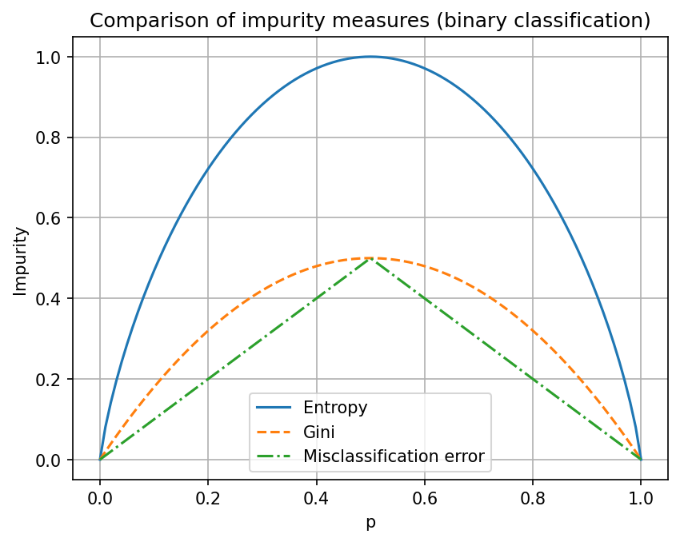
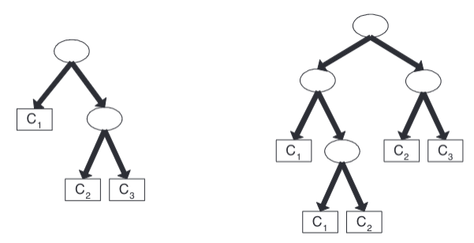

# TD3 - Arbres de Décision

---

## Exercice 1 : Mesures d'impureté
Pour exécuter les tests et générer la figure [impurity_curves.png](src/images/exo1/impurity_curves.png):

```bash
python src/exo1/run_exo1.py
```

### 1(a) Implémentation des fonctions

Nous avons implémenté trois fonctions de mesure d'impureté dans [impurity_measures.py](src/exo1/impurity_measures.py) :

| Mesure | Formule |
|--------|---------|
| **Entropy** | $H = -\sum_{j} p_j \log_2(p_j)$ |
| **Gini** | $Gini = 1 - \sum_{j} p_j^2$ |
| **Classification Error** | $Error = 1 - \max_j(p_j)$ |

Ces fonctions prennent en entrée une liste de probabilités dont la somme est égale à 1.

### 1(b) Tests avec les exemples du livre

**Résultats obtenus :**
```
probs = [0.0, 1.0]
  Entropy            = 0.0000
  Gini               = 0.0000
  Misclass. error    = 0.0000

probs = [0.1667, 0.8333]
  Entropy            = 0.6500
  Gini               = 0.2778
  Misclass. error    = 0.1667

probs = [0.5, 0.5]
  Entropy            = 1.0000
  Gini               = 0.5000
  Misclass. error    = 0.5000
```

Ces résultats correspondent exactement à ceux attendus dans le livre (page 159).

### 1(c) Reproduction de la Figure 4.13

Nous avons reproduit la figure comparant les trois mesures d'impureté pour les problèmes de classification binaire :



---

## Exercice 2 : Calcul de l'impureté après split

Pour générer les résultats de cet exercice:
```bash
python src/exo2/run_exo2.py
```

### 2(a) Fonction impurity_split

Nous avons implémenté la fonction `impurity_split(cnt, impurity_function)` dans [impurity_split.py](src/exo2/impurity_split.py:3) qui calcule l'impureté pondérée d'un split.

**Tests effectués :**

```python
d1 = {"N1": {"C0": 4, "C1": 3}, "N2": {"C0": 2, "C1": 3}}
d2 = {"N1": {"C0": 1, "C1": 4}, "N2": {"C0": 5, "C1": 2}}
```

**Résultats :**
```bash
2(a) Tests for impurity_split with Gini:
d1 = {'N1': {'C0': 4, 'C1': 3}, 'N2': {'C0': 2, 'C1': 3}}
  impurity_split(d1, gini) = 0.486
d2 = {'N1': {'C0': 1, 'C1': 4}, 'N2': {'C0': 5, 'C1': 2}}
  impurity_split(d2, gini) = 0.371
```

Ces résultats correspondent aux calculs détaillés page 161 du livre.

### Dataset utilisé pour les questions suivantes

Nous utilisons le dataset fourni avec 20 clients et 5 attributs : Customer ID, Gender, Car Type, Shirt Size, et Class (C0 ou C1).

### 2(b) Indice de Gini du dataset

```bash
2(b) Gini of entire dataset:
  Gini(dataset) = 0.500
```

Calcul : Le dataset contient 10 instances de C0 et 10 instances de C1.
$$Gini = 1 - (0.5^2 + 0.5^2) = 1 - 0.5 = 0.5$$

### 2(c) Indice de Gini de l'attribut Customer ID

```bash
2(c) Gini of attribute Customer ID (multiway):
  Gini(Customer ID) = 0.000
```

Explication : Chaque Customer ID est unique et correspond à exactement une instance. Le split crée donc 20 nœuds purs (chacun avec une seule classe), donnant un Gini de 0.

### 2(d) Indice de Gini de l'attribut Gender

```bash
2(d) Gini of attribute Gender (multiway):
  Gini(Gender) = 0.480
```

Détails du split :
- **M (Male)** : 6 instances de C0, 4 instances de C1
- **F (Female)** : 4 instances de C0, 6 instances de C1

Calcul du Gini pondéré :
- Gini(M) = 1 - (0.6² + 0.4²) = 0.48
- Gini(F) = 1 - (0.4² + 0.6²) = 0.48
- Gini_split = (10/20) × 0.48 + (10/20) × 0.48 = 0.48

### 2(e) Indice de Gini de l'attribut Car Type

```bash
2(e) Gini of attribute Car Type:
  Multiway split: 0.163
  Binary splits:
    ('Family',) vs others -> Gini_split = 0.469
    ('Luxury',) vs others -> Gini_split = 0.312
    ('Sports',) vs others -> Gini_split = 0.167
```

Le meilleur binary split est **{Sports} vs {Family, Luxury}** avec Gini = 0.167.

### 2(f) Indice de Gini de l'attribut Shirt Size (multiway split)

```bash
2(f) Gini of attribute Shirt Size (multiway):
  Gini(Shirt Size) = 0.491
```

L'attribut **Shirt Size** ne permet pas une bonne séparation des classes (Gini proche de 0.5).

### 2(g) Meilleur attribut parmi Gender, Car Type et Shirt Size

```
2(g) Best attribute among Gender / Car Type / Shirt Size?
  Gini(Gender)      = 0.480
  Gini(Car Type)    = 0.163
  Gini(Shirt Size)  = 0.491
```

**Conclusion :** **Car Type** est le meilleur attribut car il a le plus faible indice de Gini (0.163).

### 2(h) Pourquoi ne pas utiliser Customer ID ?

Bien que Customer ID ait le plus petit indice de Gini, il ne doit pas être utilisé comme attribut de test pour les raisons suivantes :

1. **Identifiant unique** : Chaque Customer ID correspond à une seule instance du dataset
2. **Overfitting** : Le modèle mémoriserait simplement chaque exemple d'entraînement
3. **Absence de généralisation** : L'arbre ne pourrait pas classifier de nouveaux clients avec des IDs différents
4. **Pas de valeur prédictive** : L'ID n'a aucune relation causale ou sémantique avec la classe cible

---

## Exercice 3 : Gain d'information et attributs continus


Pour générer les résultats de cet exercice:
```bash
python src/exo3/run_exo3.py
```

### Dataset utilisé

Nous utilisons un dataset avec 9 instances, 3 attributs et 2 classes cibles (+ et -).

### 3(a) Entropie du dataset

```bash
3(a) Entropy of dataset:
  entropy(dataset) = 0.991
```

Distribution des classes :
- Classe `-` : 5 instances
- Classe `+` : 4 instances

Calcul :
$$entropy(dataset) = -\frac{5}{9}\log_2(\frac{5}{9}) - \frac{4}{9}\log_2(\frac{4}{9}) \approx 0.991$$

### 3(b) Gain d'information pour a1 et a2

#### Attribut a1

```bash
3(b) Info gain for a1:
  entropy(dataset) = 0.991
  a1 = T: counts=Counter({'+': 3, '-': 1}), entropy = 0.811
  a1 = F: counts=Counter({'-': 4, '+': 1}), entropy = 0.722
  entropy after split on a1 = 0.762
  gain(a1) = 0.229
```

Détails du split :
- **a1 = T** : 3 instances `+`, 1 instance `-` → entropy = 0.811
- **a1 = F** : 1 instance `+`, 4 instances `-` → entropy = 0.722

Entropie pondérée après split :
$$entropy(dataset|a1) = \frac{4}{9} \times 0.811 + \frac{5}{9} \times 0.722 = 0.762$$

Gain d'information :
$$Gain(a1) = 0.991 - 0.762 = 0.229$$

#### Attribut a2

```bash
3(b) Info gain for a2:
  entropy(dataset) = 0.991
  a2 = T: counts=Counter({'-': 3, '+': 2}), entropy = 0.971
  a2 = F: counts=Counter({'-': 2, '+': 2}), entropy = 1.000
  entropy after split on a2 = 0.984
  gain(a2) = 0.007
```

Détails du split :
- **a2 = T** : 2 instances `+`, 3 instances `-` → entropy = 0.971
- **a2 = F** : 2 instances `+`, 2 instances `-` → entropy = 1.000

Entropie pondérée après split :
$$entropy(dataset|a2) = \frac{5}{9} \times 0.971 + \frac{4}{9} \times 1.000 = 0.984$$

Gain d'information :
$$Gain(a2) = 0.991 - 0.984 = 0.007$$

L'attribut a1 apporte beaucoup plus d'information (0.229) que a2 (0.007).

### 3(c) Gain d'information pour l'attribut continu a3

```bash
3(c) Info gain for continuous attribute a3 (all possible thresholds):
  entropy(dataset) = 0.991
  threshold a3 <= 2.0: left=Counter({'+': 1}), right=Counter({'-': 5, '+': 3}), entropy_split=0.848, gain=0.143
  threshold a3 <= 3.5: left=Counter({'+': 1, '-': 1}), right=Counter({'-': 4, '+': 3}), entropy_split=0.989, gain=0.003
  threshold a3 <= 4.5: left=Counter({'+': 2, '-': 1}), right=Counter({'-': 4, '+': 2}), entropy_split=0.918, gain=0.073
  threshold a3 <= 5.5: left=Counter({'-': 3, '+': 2}), right=Counter({'+': 2, '-': 2}), entropy_split=0.984, gain=0.007
  threshold a3 <= 6.5: left=Counter({'+': 3, '-': 3}), right=Counter({'-': 2, '+': 1}), entropy_split=0.973, gain=0.018
  threshold a3 <= 7.5: left=Counter({'+': 4, '-': 4}), right=Counter({'-': 1}), entropy_split=0.889, gain=0.102
```

**Valeurs de a3 :** [1.0, 3.0, 4.0, 5.0, 5.0, 6.0, 7.0, 7.0, 8.0]

**Seuils testés et résultats :**

| Seuil    | Left                      | Right                     | entropy_split | Gain  |
|----------|---------------------------|---------------------------|---------------|-------|
| a3 ≤ 2.0 | Counter({'+': 1})         | Counter({'-': 5, '+': 3}) | 0.848         | 0.143 |
| a3 ≤ 3.5 | Counter({'+': 1, '-': 1}) | Counter({'-': 4, '+': 3}) | 0.989         | 0.003 |
| a3 ≤ 4.5 | Counter({'+': 2, '-': 1}) | Counter({'-': 4, '+': 2}) | 0.918         | 0.073 |
| a3 ≤ 5.5 | Counter({'-': 3, '+': 2}) | Counter({'+': 2, '-': 2}) | 0.984         | 0.007 |
| a3 ≤ 6.5 | Counter({'+': 3, '-': 3}) | Counter({'-': 2, '+': 1}) | 0.973         | 0.018 |
| a3 ≤ 7.5 | Counter({'+': 4, '-': 4}) | Counter({'-': 1})         | 0.889         | 0.102 |

**Meilleur seuil pour a3 :** a3 ≤ 2.0 avec **Gain = 0.143**

### 3(d) Meilleur split selon le gain d'information

```bash
3(d) Best split according to information gain:
  gain(a1) = 0.229
  gain(a2) = 0.007
  Best gain(a3) = 0.143 for threshold a3 <= 2.0
  -> Best attribute: a1 (highest information gain).
```

### 3(e) Meilleur split entre a1 et a2 selon l'erreur de classification

```bash
3(e) Best split (a1 vs a2) by classification error:
  error split(a1) = 0.222
  error split(a2) = 0.444
  -> Best (lowest error): a1
```

Détails pour a1 :
- a1 = T : 4 instances, classe majoritaire `+` (3), erreur locale = 1/4 = 0.25
- a1 = F : 5 instances, classe majoritaire `-` (4), erreur locale = 1/5 = 0.20
- Erreur pondérée = (4/9) × 0.25 + (5/9) × 0.20 = 0.222

Détails pour a2 :
- a2 = T : 5 instances, classe majoritaire `-` (3), erreur locale = 2/5 = 0.40
- a2 = F : 4 instances, classes équilibrées (2, 2), erreur locale = 2/4 = 0.50
- Erreur pondérée = (5/9) × 0.40 + (4/9) × 0.50 = 0.444

### 3(f) Meilleur split entre a1 et a2 selon l'indice de Gini

```bash
3(f) Best split (a1 vs a2) by Gini index:
  gini split(a1) = 0.344
  gini split(a2) = 0.489
  -> Best (lowest Gini): a1
```

Détails pour a1 :
- a1 = T : Gini = 1 - ((3/4)² + (1/4)²) = 0.375
- a1 = F : Gini = 1 - ((1/5)² + (4/5)²) = 0.320
- Gini pondéré = (4/9) × 0.375 + (5/9) × 0.320 = 0.344

Détails pour a2 :
- a2 = T : Gini = 1 - ((2/5)² + (3/5)²) = 0.480
- a2 = F : Gini = 1 - ((2/4)² + (2/4)²) = 0.500
- Gini pondéré = (5/9) × 0.480 + (4/9) × 0.500 = 0.489

---

## Exercice 4 : Comparaison des critères de sélection

Pour générer les résultats de cet exercice:
```bash
python src/exo3/run_exo3.py
```

### Dataset utilisé

Un dataset avec 10 instances, 2 attributs binaires (A et B) et 2 classes (+ et -).

### 4(a) Gain d'information pour A et B

**Entropie du dataset :** 
```bash
  entropy(dataset) = 0.971
```

#### Attribut A

```bash
  Attribute A:
    entropy(dataset) = 0.971
    A = T: n=7, counts=Counter({'+': 4, '-': 3}), entropy = 0.985
    A = F: n=3, counts=Counter({'-': 3}), entropy = 0.000
    entropy after split on A = 0.690
    gain(A) = 0.281
```

Détails du split :
- **A = T** : n=7, distribution {'+': 4, '-': 3} → entropy = 0.985
- **A = F** : n=3, distribution {'-': 3} → entropy = 0.000

Entropie pondérée après split :
$$entropy(dataset|A) = \frac{7}{10} \times 0.985 + \frac{3}{10} \times 0.000 = 0.690$$

Gain d'information :
$$Gain(A) = 0.971 - 0.690 = 0.281$$

#### Attribut B

```bash
  Attribute B:
    entropy(dataset) = 0.971
    B = F: n=6, counts=Counter({'-': 5, '+': 1}), entropy = 0.650
    B = T: n=4, counts=Counter({'+': 3, '-': 1}), entropy = 0.811
    entropy after split on B = 0.715
    gain(B) = 0.256
```

Détails du split :
- **B = F** : n=5, distribution {'-': 5, '+': 1} → entropy = 0.650
- **B = T** : n=4, distribution {'+': 3, '-': 1} → entropy = 0.811

Entropie pondérée après split :
$$entropy(dataset|B) = \frac{5}{10} \times 0.650 + \frac{4}{10} \times 0.811 = 0.715$$

Gain d'information :
$$Gain(B) = 0.971 - 0.715 = 0.256$$

**Conclusion selon le gain d'information :** L'attribut **A** est meilleur (0.281 > 0.256).

### 4(b) Gain de Gini pour A et B

**Indice de Gini du dataset :**
```bash
  gini(dataset) = 0.480
```
Calcul :
$$Gini(D) = 1 - \left(\frac{4}{10}\right)^2 - \left(\frac{6}{10}\right)^2 = 1 - 0.16 - 0.36 = 0.480$$

#### Attribut A

```bash
  Attribute A:
    A = T: n=7, counts=Counter({'+': 4, '-': 3}), gini = 0.490
    A = F: n=3, counts=Counter({'-': 3}), gini = 0.000
    gini after split on A = 0.343
    gini gain(A) = 0.137
```

Détails du split :
- **A = T** : n=7, distribution {'+': 4, '-': 3} → Gini = 0.490
- **A = F** : n=3, distribution {'-': 3} → Gini = 0.000

Gini pondéré après split :
$$Gini(dataset|A) = \frac{7}{10} \times 0.490 + \frac{3}{10} \times 0.000 = 0.343$$

Gain de Gini :
$$Gini\_gain(A) = 0.480 - 0.343 = 0.137$$

#### Attribut B

```bash
  Attribute B:
    B = F: n=6, counts=Counter({'-': 5, '+': 1}), gini = 0.278
    B = T: n=4, counts=Counter({'+': 3, '-': 1}), gini = 0.375
    gini after split on B = 0.317
    gini gain(B) = 0.163
```

Détails du split :
- **B = F** : n=5, distribution {'-': 5, '+': 1} → Gini = 0.278
- **B = T** : n=4, distribution {'+': 3, '-': 1} → Gini = 0.375

Gini pondéré après split :
$$Gini(dataset|B) = \frac{5}{10} \times 0.278 + \frac{4}{10} \times 0.375 = 0.317$$

Gain de Gini :
$$Gini\_gain(B) = 0.480 - 0.317 = 0.163$$

**Conclusion selon le gain de Gini :** L'attribut **B** est meilleur (0.163 > 0.137).

### 4(c) Comparaison : les deux critères peuvent-ils favoriser des attributs différents ?

**Réponse : OUI**

| Critère | Meilleur attribut | Score |
|---------|-------------------|-------|
| Gain d'information | **A** | 0.281 |
| Gain de Gini | **B** | 0.163 |

L'entropie favorise A car il crée un nœud parfaitement pur (A = F -> 100% classe `-`). Le Gini favorise B car il produit des partitions plus équilibrées en taille. Cette différence illustre qu'il n'existe pas de mesure d'impureté universellement meilleure.

---

## Exercice 5 : Principe MDL (Minimum Description Length)

Pour générer les résultats de cet exercice:
```bash
python src/exo5/run_exo5.py
```

### Contexte

Cet exercice utilise le principe du rasoir d'Occam via la Longueur de Description Minimale (MDL) pour comparer deux arbres de décision générés à partir d'un dataset avec :
- 16 attributs binaires
- 3 classes (C1, C2, C3)



**Encodage**:
- gauche: ["C1", ["C2", "C3"]]
- droite: \[["C1", ["C1", "C2"]], ["C2", "C3"]]

### 5(a) Calcul de Cost(tree)

```bash
Cost(tree) only:
  left tree  = 14
  right tree = 26
```

**Fonction implémentée dans** [run_exo5.py](src/exo5/run_exo5.py:28)

**Paramètres :**
- m = 16 attributs → ⌈log₂(16)⌉ = 4 bits/attribut
- k = 3 classes → ⌈log₂(3)⌉ = 2 bits/classe

**Calcul :**

| Arbre | Structure (internes, feuilles) | Cost(tree) |
|-------|-------------------------------|------------|
| **Gauche** | (2, 3) | 2×4 + 3×2 = **14 bits** |
| **Droite** | (4, 5) | 4×4 + 5×2 = **26 bits** |

### 5(b) Quel arbre est le meilleur selon MDL ?

Le coût total selon MDL est :
```
Total Cost = Cost(tree) + Cost(data|tree)
Cost(data|tree) = nb_errors × ⌈log₂(n)⌉
```
```bash
n = 8
  Total cost left tree  = 35 bits
  Total cost right tree = 38 bits

n = 16
  Total cost left tree  = 42 bits
  Total cost right tree = 42 bits

n = 32
  Total cost left tree  = 49 bits
  Total cost right tree = 46 bits

n = 64
  Total cost left tree  = 56 bits
  Total cost right tree = 50 bits
```

**Résultats :**

| n | Gauche (14 bits, 7 erreurs) | Droite (26 bits, 4 erreurs) | Meilleur |
|---|----------------------------|----------------------------|----------|
| 8 | 35 bits | 38 bits | **Gauche** |
| 16 | 42 bits | 42 bits | **Égalité** |
| 32 | 49 bits | 46 bits | **Droite** |
| 64 | 56 bits | 50 bits | **Droite** |

**Analyse :**

Le **point de bascule est n = 16** :
```
14 + 7×⌈log₂(n)⌉ = 26 + 4×⌈log₂(n)⌉
→ 3×⌈log₂(n)⌉ = 12
→ ⌈log₂(n)⌉ = 4  donc n = 16
```

- **n < 16** : Arbre gauche préféré (simplicité > précision)
- **n > 16** : Arbre droite préféré (précision > complexité)

**Conclusion :** Le principe MDL illustre le rasoir d'Occam : un modèle plus complexe n'est justifié que s'il réduit suffisamment les erreurs. Ce compromis est au cœur de la régularisation en machine learning.

---

## Exercice 6 : Utilisation de sklearn et fonction de parité

Pour générer les résultats de cet exercice et les figures [parity_tree_entropy.png](src/images/exo6/parity_tree_entropy.png),  [parity_tree_entropy_rs.png](src/images/exo6/parity_tree_entropy_rs.png),  [parity_tree_gini.png](src/images/exo6/parity_tree_gini.png),  [parity_tree_shallow.png](src/images/exo6/parity_tree_shallow.png):
```bash
python src/exo6/run_exo6.py
```

### 6(a) Génération du dataset de parité

Nous avons généré un dataset avec 5 attributs (A, B, C, D, Class) encodant la fonction de parité de 4 attributs booléens.

**Caractéristiques du dataset :**
- **16 tuples** : toutes les combinaisons possibles de 4 attributs binaires (2⁴ = 16)
- **Attributs** : A, B, C, D ∈ {0, 1}
- **Classe** : Class = 1 si (A + B + C + D) est impair, 0 sinon

### 6(b) Encodage pour sklearn et limitation des types

Pour utiliser `DecisionTreeClassifier.fit()`, nous devons encoder les données en format numérique :

```python
X = np.array([[a, b, c, d], ...], dtype=float)  # shape: (16, 4)
y = np.array([class_label, ...], dtype=int)      # shape: (16,)
```

**Limitation observée concernant le type de données :**

Scikit-learn **n'accepte que des données numériques** (int, float) pour les features. Les types de données suivants **ne sont pas acceptés directement** :
- Chaînes de caractères ('T', 'F', 'True', 'False')
- Valeurs booléennes Python (True, False) *[doivent être converties en 0/1]*
- Variables catégorielles textuelles

**Conséquence pratique :** Avant d'utiliser sklearn, il faut toujours **encoder les variables catégorielles et booléennes en nombres**. Pour des catégories non ordonnées, on utilise généralement le **One-Hot Encoding**.

Dans notre cas, les booléens sont naturellement encodés comme 0 et 1, donc la conversion est directe.

### 6(c) Arbres de décision avec différents paramètres

Nous avons généré plusieurs arbres en variant les paramètres pour observer les changements.


**Résultats des différentes configurations :**

| Configuration | Critère | random_state | max_depth | Accuracy |
|---------------|---------|--------------|-----------|----------|
| 1 | entropy | 0 | None | **1.0** |
| 2 | gini | 0 | None | **1.0** |
| 3 | entropy | 42 | None | **1.0** |
| 4 | entropy | 0 | 2 | **0.5** (underfitting) |

**Observations :**

#### 1. Changement de mesure d'impureté (entropy vs gini)

**Sans changement apparent !** Les deux critères produisent des arbres parfaitement précis (accuracy = 1.0).

**Explication :** Pour la fonction de parité, l'arbre optimal doit être un arbre binaire complet de profondeur 4 (utilisant tous les attributs). Peu importe le critère d'impureté, l'algorithme finit par construire cet arbre complet pour classifier correctement toutes les instances.

#### 2. Changement de random_state

**Sans changement significatif !** L'accuracy reste à 1.0.

**Explication :** Le paramètre `random_state` contrôle l'aléatoire lors des choix (par exemple, quand deux attributs ont le même gain). Pour la fonction de parité, même si l'ordre des splits peut légèrement changer, l'arbre final doit utiliser tous les 4 attributs pour atteindre une précision parfaite.

**Différences possibles :**
- L'ordre des attributs testés peut varier
- La structure exacte de l'arbre peut différer
- Mais la précision finale et le nombre de nœuds restent identiques

#### 3. Limitation de profondeur (max_depth=2)

**Underfitting sévère !** Accuracy = 0.5 (équivalent à un choix aléatoire).

**Explication :** La fonction de parité **requiert absolument** un arbre de profondeur 4 (un attribut par niveau). Avec `max_depth=2`, l'arbre ne peut utiliser que 2 attributs sur 4, ce qui est totalement insuffisant.

**Structure avec max_depth=2 :**
- Profondeur maximale : 2
- Nombre de feuilles : au maximum 4
- Problème : Il faut 16 feuilles distinctes pour séparer parfaitement les 16 instances !

L'arbre peu profond ne peut pas capturer la complexité de la fonction XOR multi-variables.

### Analyse théorique de la fonction de parité

La fonction de parité est un **cas difficile** pour les arbres de décision :

**Pourquoi ?**

1. **Non-linéarité** : C'est une fonction XOR généralisée, intrinsèquement non-linéaire
2. **Tous les attributs sont essentiels** : On ne peut pas ignorer un seul attribut
3. **Aucune réduction possible** : L'arbre optimal nécessite 2⁴ = 16 feuilles
4. **Pas de simplification** : Aucun sous-arbre ne peut être élagué sans perte de précision

**Taille de l'arbre optimal :**
- **Nœuds internes** : 15 (arbre binaire complet de profondeur 4)
- **Feuilles** : 16
- **Profondeur** : 4

**Généralisation :** Pour une fonction de parité à n attributs, l'arbre optimal a une taille exponentielle en n (2ⁿ feuilles), ce qui illustre une **limitation fondamentale** des arbres de décision pour certaines fonctions.

### Observation sur la stabilité

**Question :** Que se passe-t-il si on entraîne plusieurs fois sans changer de paramètres ?

Avec `random_state` fixé : **l'arbre est identique** à chaque exécution (déterministe).

Sans `random_state` fixé : L'arbre peut varier légèrement dans sa structure (ordre des tests), mais :
- La précision reste à 1.0
- Tous les 4 attributs sont utilisés
- Le nombre total de nœuds reste le même

**Conclusion :** Pour un problème déterministe comme la parité, avec un dataset complet (toutes les combinaisons), l'arbre converge toujours vers une solution parfaite, quelle que soit la mesure d'impureté choisie.