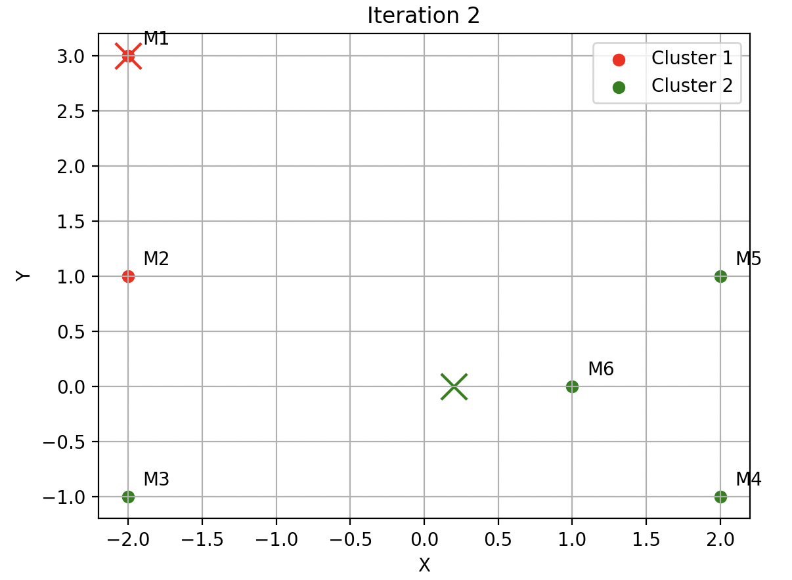
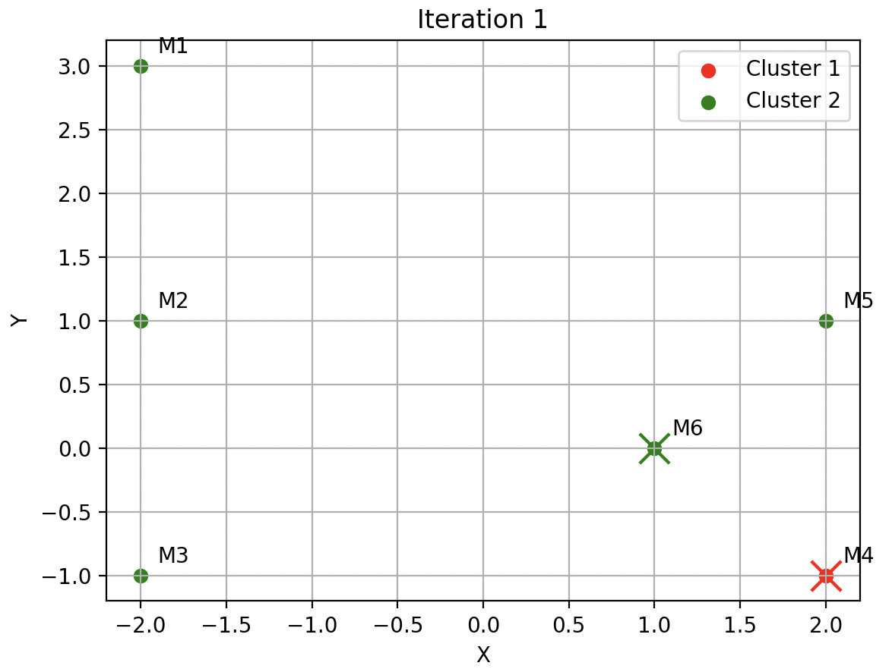
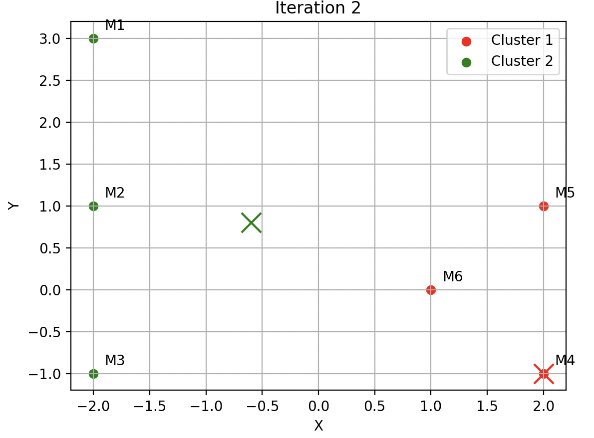
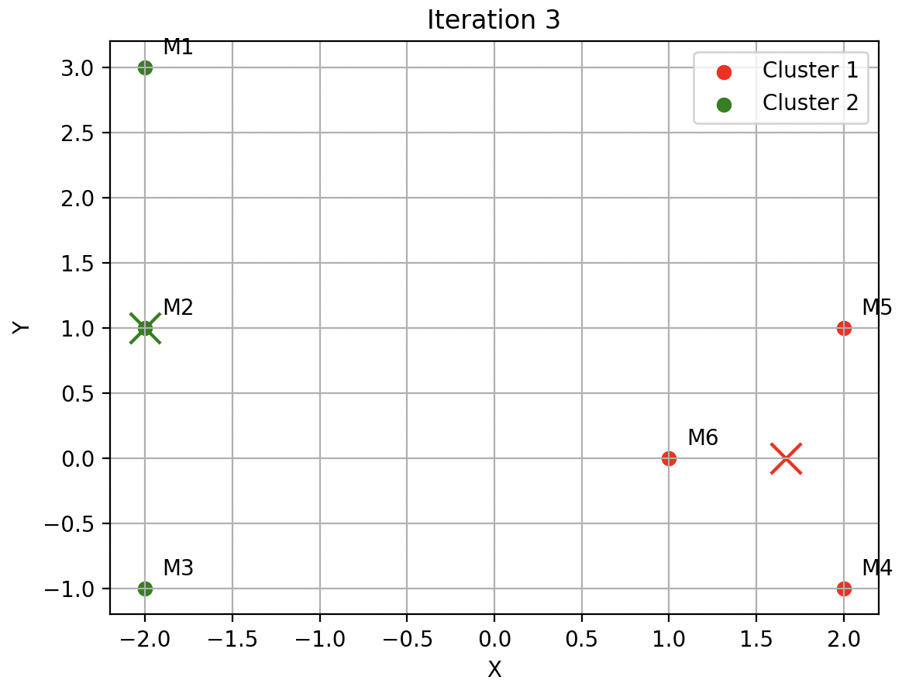
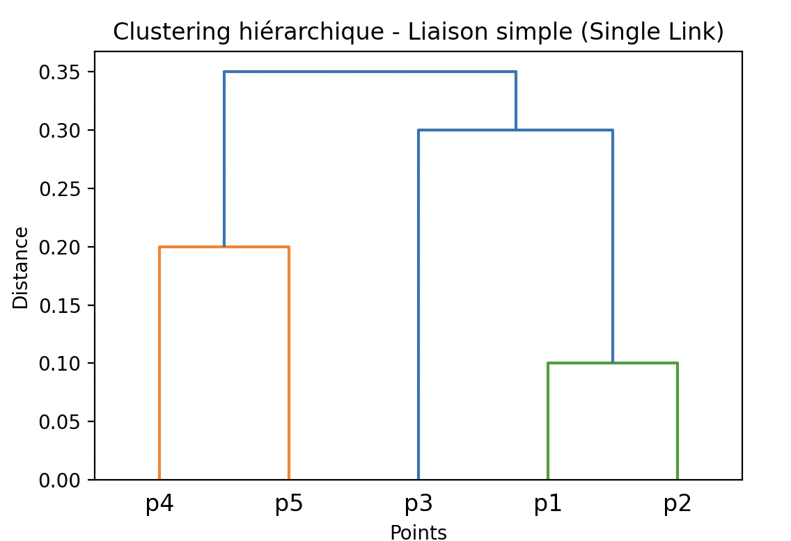
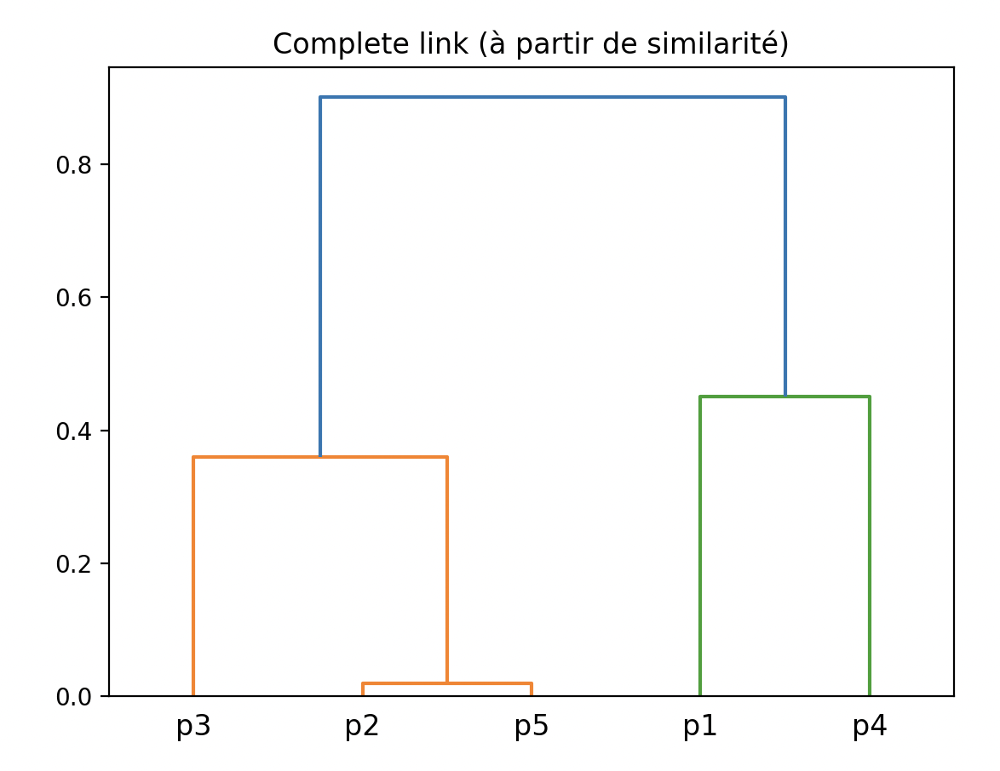
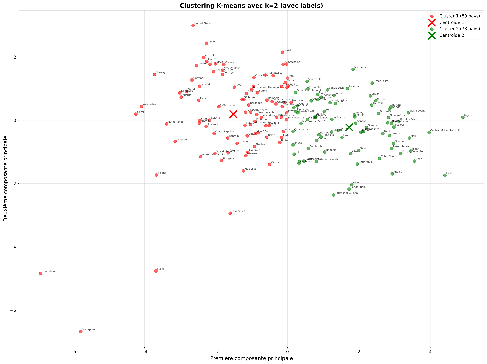
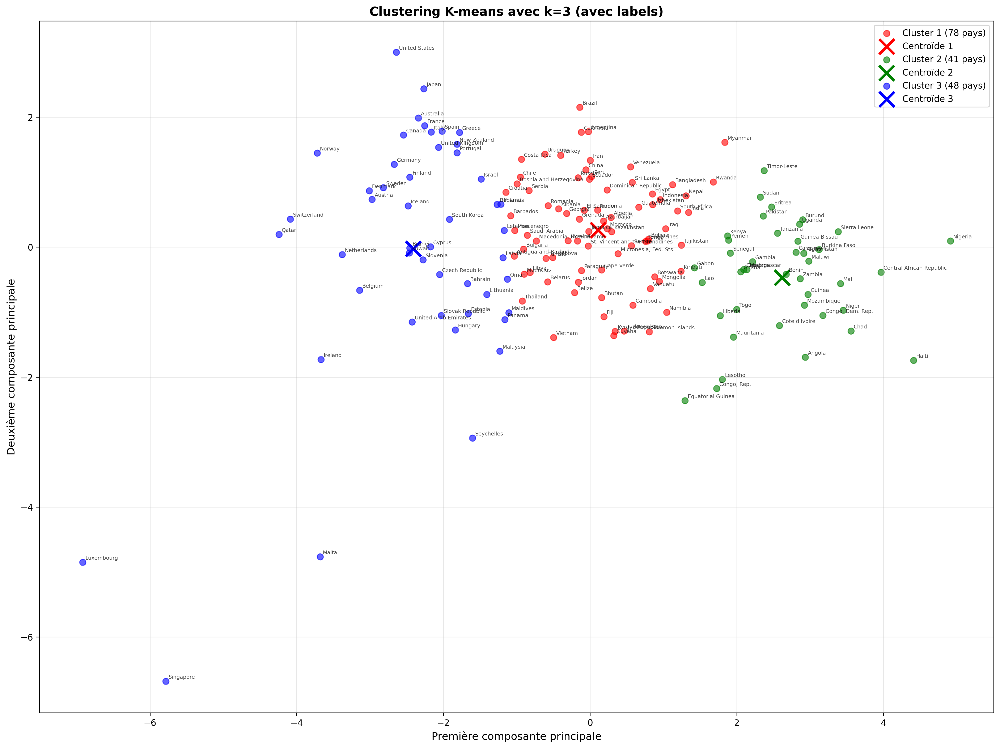
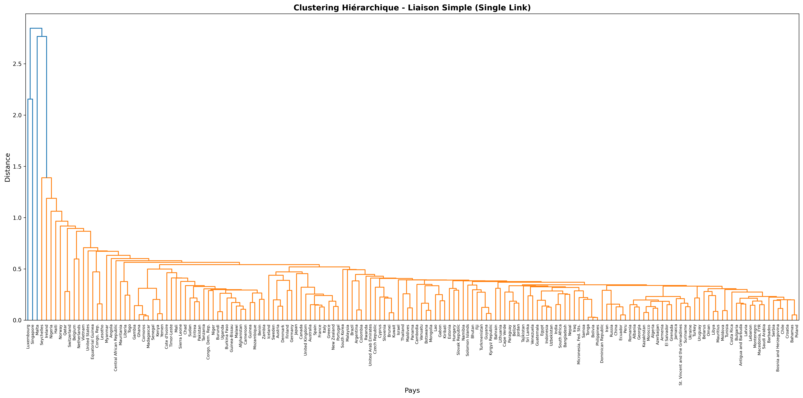
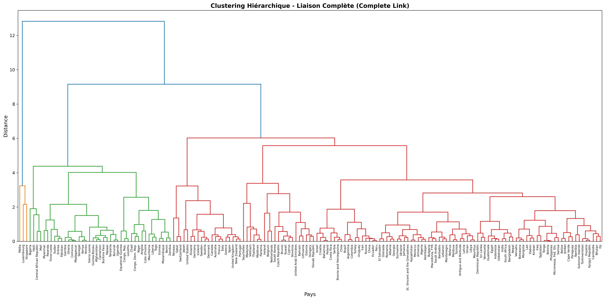

## 1 Clustering k-means
### 1.1 Implémentation
Le fonction `kmeans(data, k, centroids_init=None, max_iter=100)` qui applique l’algorithme k-means dans le fichier *k_means_1D.py*
### 1.2 Tests sur le jeu de données 1D
Jeu de données :  
`[[2], [4], [6], [12], [24], [30]]`
(a) Avec centroïdes initiaux  `[[2], [6]]`
Résultat:

```
Iteration 1
Centroid [2] Points [[2], [4]]
Centroid [6] Points [[6], [12], [24], [30]]

Iteration 2
Centroid [3.0] Points [[2], [4], [6]]
Centroid [18.0] Points [[12], [24], [30]]

Iteration 3
Centroid [4.0] Points [[2], [4], [6], [12]]
Centroid [22.0] Points [[24], [30]]

Iteration 4
Centroid [6.0] Points [[2], [4], [6], [12]]
Centroid [27.0] Points [[24], [30]]
Fin clustering, erreur = 74.00
```

(b) Avec centroïdes initiaux `[[12], [24]]`
Résultat:

```
Iteration 1
Centroid [12] Points [[2], [4], [6], [12]]
Centroid [24] Points [[24], [30]]

Iteration 2
Centroid [6.0] Points [[2], [4], [6], [12]]
Centroid [27.0] Points [[24], [30]]
Fin clustering, erreur = 74.00
```

Les deux configurations de centroïdes initiaux aboutissent à la même partition finale :
- Cluster 1 : `[[2], [4], [6], [12]]`
- Cluster 2:  `[[24], [30]]`
- Centroïdes finaux : `[6.0] et [27.0]`
- Erreur (SSE) = 74.00
L’algorithme converge vers la même solution optimale, quel que soit le choix initial des centroïdes.  
Aucun clustering n’est meilleur que l’autre : les deux donnent la même erreur et la même séparation logique des données.


### 1.3 Visualisation 2D
La fonction `kmeans_2d` dans le fichier *k_means_2D.py* , version étendue de `kmeans`, affiche la répartition des points et des centroïdes à chaque itération à l’aide de *matplotlib*.
Paramètres optionnels ajoutés :
- `names` : liste des noms des points, utilisée pour annoter chaque point sur la figure.
- `visualize` : booléen (True par défaut) activant la génération automatique des figures à chaque itération.

Jeu de données :  
M1(−2, 3), M2(−2, 1), M3(−2, −1), M4(2, −1), M5(2, 1), M6(1, 0)

(a) Avec centroïdes initiaux M1 et M2:
<p align="center">
  
  
  
</p>


```
points=[[-2,3],[-2,1],[-2,-1],[2,-1],[2,1],[1,0]]
names=["M1","M2","M3","M4","M5","M6"]
kmeans_2d(points,2,centroids_init=[[-2,3],[-2,1]],names=names)
```
Résultat:
```
Iteration 1
Centroid [-2, 3] Points [[-2, 3]]
Centroid [-2, 1] Points [[-2, 1], [-2, -1], [2, -1], [2, 1], [1, 0]]

Iteration 2
Centroid [-2.0, 3.0] Points [[-2, 3], [-2, 1]]
Centroid [0.2, 0.0] Points [[-2, -1], [2, -1], [2, 1], [1, 0]]

Iteration 3
Centroid [-2.0, 2.0] Points [[-2, 3], [-2, 1]]
Centroid [0.75, -0.25] Points [[-2, -1], [2, -1], [2, 1], [1, 0]]
Fin clustering, erreur = 15.50
```
Après 3 itérations, les points se regroupent en deux clusters stables :
- **C1 (rouge)** : M1, M2
- **C2 (vert)** : M3, M4, M5, M6
Les centroïdes finaux `[-2.0, 2.0]` et `[0.75, -0.25]`

(b) Avec centroïdes initiaux M4 et M6:

<p align="center">
  
  
  
</p>

```
points=[[-2,3],[-2,1],[-2,-1],[2,-1],[2,1],[1,0]]
names=["M1","M2","M3","M4","M5","M6"]
kmeans_2d(points,2,centroids_init=[[2,-1],[1,0]],names=names)
```
Résultat:
```
Iteration 1
Centroid [2, -1] Points [[2, -1]]
Centroid [1, 0] Points [[-2, 3], [-2, 1], [-2, -1], [2, 1], [1, 0]]

Iteration 2
Centroid [2.0, -1.0] Points [[2, -1], [2, 1], [1, 0]]
Centroid [-0.6, 0.8] Points [[-2, 3], [-2, 1], [-2, -1]]

Iteration 3
Centroid [1.6666666666666667, 0.0] Points [[2, -1], [2, 1], [1, 0]]
Centroid [-2.0, 1.0] Points [[-2, 3], [-2, 1], [-2, -1]]
Fin clustering, erreur = 10.67
```
Après 3 itérations, les points se regroupent en deux clusters stables :
- C1 (rouge)** : M4, M5, M6
- **C2 (vert)** : M1, M2, M3
Les centroïdes finaux `[1.67, 0.0]` et `[-2.0, 1.0]`

**Interprétation finale** — cas (a) & (b)
- Les deux initialisations convergent en 3 itérations vers 2 clusters stables, mais l’affectation de M3 dépend de l’initialisation.
- **Cas (a)** (centroïdes finaux `[-2,2]` et `[0.75,-0.25]`) : clusters {M1,M2} et {M3,M4,M5,M6} avec SSE = 15.50.
- **Cas (b)** (centroïdes finaux `[1.67,0]` et `[-2,1]`) : clusters {M4,M5,M6} et {M1,M2,M3} avec SSE = 10.67
**Conclusion**: Le cas (b) donne une séparation plus naturelle et une erreur (SSE) plus faible, donc un clustering de meilleure qualité.

### 1.4 Vérification avec Scikit-Learn
(a) Jeu de données `[[1],[2],[18],[20],[31]]`
Les valeurs d’étiquettes (0/1/2) sont arbitraires :
- première init : résultat = `[0 1 2 2 2]` alors clusters = `{[1]}, {[2]}, {[18],[20],[31]}` ;
- seconde init : résultat = `[0 0 1 1 2]` alors clusters = `{[1],[2]}, {[18],[20]}, {[31]}` ;
Ce sont exactement les mêmes partitions que dans 1.1 (à permutation près des labels).

(b) Exercice 2 - `[[2],[4],[6],[12],[24],[30]]`, `k=2`

```
data2 = array([[2], [4], [6], [12], [24], [30]])

print(KMeans(n_clusters=2, n_init=1, init=array([[2], [6]])).fit(data2).labels_)
print(KMeans(n_clusters=2, n_init=1, init=array([[12], [24]])).fit(data2).labels_)
```
Résultat:
```
[0 0 0 0 1 1]
[0 0 0 0 1 1]
```
Dans les deux cas, mêmes clusters finaux que notre code : {[2],[4],[6],[12]} et {[24],[30]}.

(c) Exercice 3 -  `M1(−2, 3), M2(−2, 1), M3(−2, −1), M4(2, −1), M5(2, 1), M6(1, 0)` `k=3`
```
data3 = array([[-2, 3], [-2, 1], [-2, -1], [2, -1], [2, 1], [1, 0]])

# Cas (a) : init M1 & M2
print(KMeans(n_clusters=2, n_init=1, init=array([[-2, 3], [-2, 1]])).fit(data3).labels_)

# Cas (b) : init M4 & M6
print(KMeans(n_clusters=2, n_init=1, init=array([[2, -1], [1, 0]])).fit(data3).labels_)
```

Résultat:

```
[0 0 1 1 1 1]
[1 1 1 0 0 0]
```

Cas (a) : clusters {M1,M2} et {M3,M4,M5,M6} (comme notre implémentation).
Cas (b) : clusters {M1,M2,M3} et {M4,M5,M6} (comme notre implémentation).

**Conclusion** — Pour 1.1, 1.2 et 1.3, sklearn.KMeans retrouve les mêmes partitions que notre code (à permutation des labels près), validant l’implémentation.


## 2 Clustering Hiérachie
## 2.1 Clustering hiérarchique à partir d’une matrice de distance
Encodage au format 1D : `data = [0.1, 0.9, 0.35, 0.8, 0.3, 0.4, 0.5, 0.6, 0.7, 0.2]`

Le code d’exécution est disponible dans le fichier `hierarchy.py`.

<p align="center">
  
  
</p>

## 2.2 Clustering hiérarchique à partir d’une matrice de similarité

Conversion en distance :  
`distance(pᵢ, pⱼ) = 1 - similarité(pᵢ, pⱼ)`

Le code d’exécution est dans le fichier `similarity.py`.

<p align="center">
  
  
</p>


## 3 Étude de cas

### 3.1 Préparation des données

Parsing du fichier `Country-data.csv` et application de PCA sur données centrées réduites :

```python
data_country, country_names = parse_country_data('Country-data.csv')
data_reduced = pca_reduction(data_country, country_names)
```

Résultat obtenu :
```
First country: Afghanistan
Data: [90.2, 10.0, 7.58, 44.9, 1610.0, 9.44, 56.2, 5.82, 553.0]

data_reduced commence par: [[2.91, -0.10], [-0.43, 0.59], ...]
```

Code disponible dans `etude_de_cas.py`.

### 3.2 Clustering K-means

**K-means avec k=2**

```python
centroids_2, clusters_2, sse_2 = kmeans_2d(data_reduced, k=2, max_iter=100, visualize=False)
plot_kmeans_with_labels(data_reduced, centroids_2, clusters_2, country_names, k=2, 
                       filename='country_data_k2.png')
```

<p align="center">
  
</p>

**Interprétation** :  
Les 167 pays se répartissent clairement en deux groupes selon leur niveau de développement socio-économique :
- **Cluster rouge (89 pays)** : pays à développement élevé ou économies émergentes à revenu intermédiaire supérieur (Europe occidentale et nordique, États-Unis, Canada, Australie, Japon, Corée du Sud, Singapour, etc.).
- **Cluster vert  (78 pays)** : pays en développement ou à faible revenu (principalement Afrique subsaharienne, Asie du Sud et quelques pays d’Asie du Sud-Est).
Les proximités sont cohérentes (pays scandinaves regroupés, pays africains proches) et on observe aussi des rapprochements intéressants entre pays éloignés géographiquement mais similaires économiquement.


**K-means avec k=3**

```python
centroids_3, clusters_3, sse_3 = kmeans_2d(data_reduced, k=3, max_iter=100, visualize=False)
plot_kmeans_with_labels(data_reduced, centroids_3, clusters_3, country_names, k=3,
                       filename='country_data_k3.png')
```

<p align="center">
  
</p>

**Interprétation** :  
Le passage à trois centres révèle trois niveaux de développement distincts, tout en conservant des frontières similaires :
- **Cluster bleu (48 pays)** : très haut niveau de développement (Europe occidentale et nordique, Amérique du Nord, Australie, Japon, Singapour, Luxembourg, etc.).
- **Cluster rouge (78 pays)** : niveau intermédiaire ou économies émergentes (Europe de l’Est, Amérique latine, Moyen-Orient riche en hydrocarbures, une partie de l’Asie du Sud-Est).
- **Cluster vert (41 pays)** : faible niveau de développement (grande majorité des pays d’Afrique subsaharienne et quelques pays d’Asie du Sud).

La SSE passe de 503,02 (k=2) à 371,03 (k=3), signe d’une meilleure cohérence interne malgré quelques pays "frontières" qui changent de groupe selon les initialisations.
**Discussion sur l'initialisation** :  
La structure naturelle des données étant marquée, plusieurs exécutions avec centroïdes aléatoires donnent des résultats similaires. Quelques pays "frontières" peuvent changer de cluster, mais les SSE restent cohérents.

### 3.3 Clustering hiérarchique

**Single Link**

```python
hierarchical_clustering(data_reduced, country_names, method='single', 
                       filename='country_data_single_link.png')
```

<p align="center">
  
</p>

**Interprétation** :  
 Le dendrogramme (`country_data_single_link.png`) montre un enchaînement très progressif : toutes les fusions restent sous la distance 0,5 jusqu’à ce que presque tous les pays soient regroupés. Même en coupant à distance 1, on n’obtient que deux blocs (Luxembourg/Singapour d’un côté, tout le reste de l’autre), ce qui illustre l’effet de « chaînage » : chaque nouveau pays se rattache au cluster existant dès qu’un voisin est proche, rendant l’extraction de groupes stables très délicate. Ce mode de liaison peut néanmoins révéler des chaînes géographiques ou économiques (par exemple une suite de pays africains voisins), mais il n’est pas adapté ici pour différencier les niveaux de développement.


**Complete Link**

```python
hierarchical_clustering(data_reduced, country_names, method='complete',
                       filename='country_data_complete_link.png')
```

<p align="center">
  
</p>

**Interprétation** :  
Avec la liaison complète (`country_data_complete_link.png`), la hiérarchie est plus équilibrée : trois grandes branches émergent entre les distances 4 et 5. En coupant le dendrogramme autour de 4,5, on retrouve quasiment les trois clusters de k-means : à gauche les pays à faible revenu (Afrique subsaharienne, Asie du Sud), au centre les économies intermédiaires/émergentes, à droite les pays développés (Europe/OCDE, Amérique du Nord, Australie, Japon). Cette correspondance directe avec l’analyse socio-économique justifie la préférence pour le complete link sur ce jeu de données.


**Comparaison.** Le complete link offre donc des groupes plus cohérents pour ce jeu de données, tandis que le single link reste utile surtout pour repérer des chaînes locales.

### 3.4 Interprétation et discussion

**Proximités attendues** : pays scandinaves (Norvège, Suède, Danemark, Finlande), Europe occidentale (France, Allemagne, Royaume-Uni), Afrique subsaharienne (Niger, Mali, Tchad).

**Proximités surprenantes** : économies asiatiques avancées (Corée du Sud, Singapour) se rapprochant des pays européens développés ; certains pays d’Amérique latine (Chili, Uruguay) alignés avec l’Europe de l’Est ; pays du Moyen-Orient répartis dans différents clusters selon leurs indicateurs économiques.

**Conclusion** : Les clusterings k-means et hiérarchiques convergent vers une structure dictée par le degré de développement socio-économique plutôt que par la géographie.
